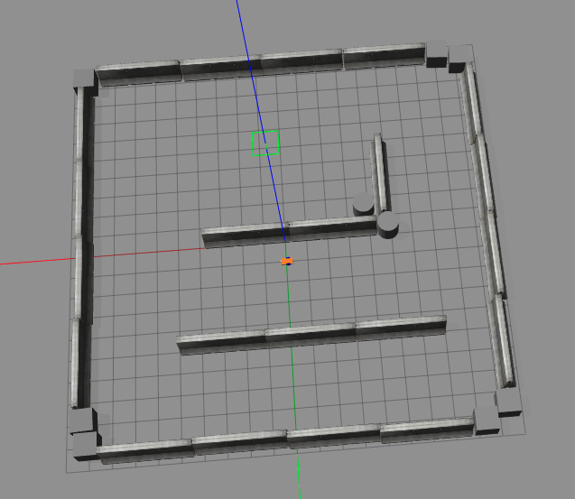
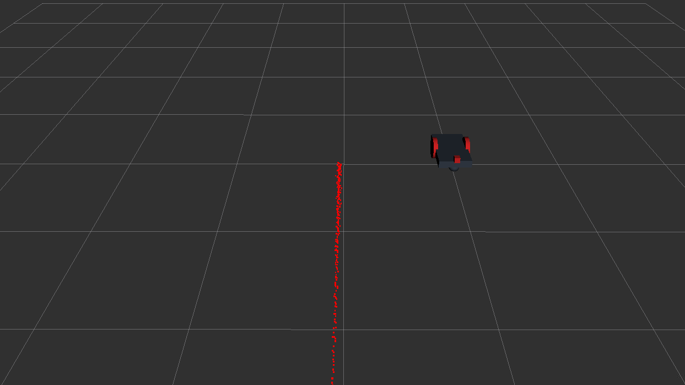

Second assignment
================================

This is a possible implementation of the second assignment of Reaserch Track 1 couse. 

The goal of this assignment is to familiarize with **ROS** by developing 3 (splitted into 4) nodes for specific 3D **Gazebo** and **Rviz** simulations.

Installing
----------------------

To run this assignment it is necessary to have **ROS noetic** version installed. The simplest way is to have the [**Docker**](https://docs.docker.com/get-docker/) and then follow this [**ROS guide**](http://wiki.ros.org/ROS/Installation).

To launch the 4 nodes, it is necessary to install **xterm** terminal using the command ```apt-get install xterm```.

It is also necessary to create a workspace and named it `/my_ros`. You can find how to create a workspace on [wiki.ros.org](http://wiki.ros.org/catkin/Tutorials/create_a_workspace).

How to run
----------------------

To launch the assignment is necessary to clone the GitHub repository using:

```bash
git clone command https://github.com/VeronicaG24/follow_goal.git
```

and move all the content into the folder `/my_ros/src`.
Then from the workspace, compile using:

```bash
catkin_make
```

Now, open two different terminal windows and move into `/my_ros` workspace.
In the first terminal, launch **Gazebo** and **Rviz** simulations using  the following command:

```bash
launch assignment_2_2022 assignment1.launch
```

Two windows of **Gazebo** and **Rviz** will be spawed:

<table><tr>
  <td>  </td>
  <td>  </td>
</tr>
<tr>
   <td>Gazebo window</td>
   <td>Rviz window</td>
  </tr>
</table>

And then, from the other terminal, launch all the nodes:

```bash
launch follow_goal follow_goal.launch
```

Requirements
----------------------

The code is designed to respect the following requirements:

* Develop four nodes:
    1. A setting node: allows the user to set a goal position (x, y) or to delete it
    2. A publisher node: publishes the current robot position (x, y) and velocities (vel_x, vel_y);
    3. A service node: prints the number of goals reached and deleted
    4. A subscriber node: prints the euclidian distance from the target, and the average speed of the robot
* Create a **launch file**, to start the whole program, and pass the rate parameter for printing the information of the subscriber node

Description of the code
----------------------

As described before, four nodes have been developed in cpp language:
1. `goal_set`: to set goal coordinates
2. `publisher`: to publish position and velocity of the robot
3. `goal_count`: prints the number of goal reached and deleted
4. `subscriber`: prints euclidian distance and average velocity

"goal_set" node
----------------------

Global variables are defined at the start of the code:

* `reached`: integer for number of goals reached
* `deleted`: integer for number of goals deleted
* `x_pos`: float for x-coordinate of the position of the robot
* `y_pos`: float for y-coordinate of the position of the robot
* `client`: instance for client
* `srv`: instance for service

The code is divided into separate functions:

* `main(int argc, char **argv)`: manages ROS init, NodeHandle, action client, and the option choosed from the menu.

```python
define varible for choosed option;
define varible for number of succeed goals reached;
define variable to state if a goal is set, set to 0;

call ROS init function with arguments argc, argv, "goal_set";
define NodeHandle;
Create action client;
get state from action client;
call waitForService method;

while ROS is working: {
    call input_menu function
    get the state of the action client
    set state for setting goal as the comparison between "SUCCEEDED" and  the state of the action client

    if the state of the action client is not 0 and the comparison returns 0:
        decrease variable to state if the goal is set

    switch in base of values of varible for choosed option: {
        case when = 1:
            get the state from getState method;
            compare "SUCCEEDED" and object state; 

            if the comparison return 1 and a goal is set:
                ask to delate the goal before setting a new one
            
            if the comparison return 0 and a goal is set
                decrease variable to state if the goal is set;
            else
                call ask_goal() function;
                set x coordinate of the goal;
                set y coordinate of the goal;
                send the goal to the action client;
                increase variable to state if the goal is set;

            wait 1 second;
        case when = 2:
            get the state from getState method;
            compare "SUCCEEDED" and object state; 
            
            if the comparison return 1 and a goal is set:
                cancel goal;
                decrease variable to state if the goal is set;
            else
                ask to set a goal;

            wait 1 second;
        case when = 3:
            get the number of delated and reached goal;
            call get_number_goals() function;
            wait 1 second;
        case when = 4: 
            if a goal is set:
                cancel goal;
            exit the program;
        default case:
            wait 1 second;
    }
}

return 0;
```

* `get_bumber_goals()`: calls the custom service and print the number of reached and deleted goal.

```python
call waitForExistence method;
invoke the call method;

get number of reached goals;
get number of deleted goals;

print the numbers;
```

* `input_menu()`: ask the user to choose an option from the menu, and return the answer.

```python
show the menu;

get the user anwer;

retun the value choosed;
```

* `ask_goal()`: ask the user to choose the x and y coordinates of the goal.

```python
ask for x coordinate;
get the user anwer;

ask for y coordinate;
get the user anwer;
```

**publisher** node
----------------------

Global variables are defined at the start of the code:

* `x_pos`: float for x-coordinate of the position of the robot
* `y_pos`: float for y-coordinate of the position of the robot
* `x_vel`: float for x-coordinate of the velocity of the robot
* `y_vel`: float for y-coordinate of the velocity of the robot
* `pub`: instance for publisher

The code is divided into separate functions:

* `main(int argc, char **argv)`: manages ROS init, NodeHandle, subscriber and publisher.

```python
call ROS init function with arguments argc, argv, "publisher_robot";

define NodeHandle;

call subscriber method with arguments "/odom", 1, and pos_vel_callback, assign the retun velue to `sub` object;

call advertise method with argument "/robot_info", and 0, assign the retun velue to `pub`;

wait 1 second;
call spin() method;

return 0;
```

* `pos_vel_callback(const nav_msgs::Odometry::ConstPtr& msg)`: get position and velocity of the robot from topic "/odom", and publish them to custom topic "/pos_vel".

```python
print robot info;

assign to varible `x_pos` the attribute pose.pose.position.x of msg;
assign to varible `y_pos` the attribute pose.pose.position.y of msg;
assign to varible `x_vel` the attribute twist.twist.linear.x of msg;
assign to varible `y_vel` the attribute twist.twist.linear.y of msg;

define object `pos_vel` of custom topic;

assign to attribute `pos_vel.x_pos` the value of the variable `x_pos`;
assign to attribute `pos_vel.y_pos` the value of the variable `y_pos`;
assign to attribute `pos_vel.x_vel` the value of the variable `x_vel`;
assign to attribute `pos_vel.y_vel` the value of the variable `x_vel`;

call publisher method for `pos_vel` object;
```

**goal_count** node
----------------------

Global variables are defined at the start of the code:

* `status`: integer for the status of the reaching goal phase;
* `reached_goal`: integer to count the reached goals, set initially to 0
* `deleted_goal`: integer to count the deleted goals, set initially to 0

The code is divided into separate functions:

* `main(int argc, char** argv)`: manages ROS init, NodeHandle, subscriber, and service.

```python
call ROS init function with arguments argc, argv, "goal_count";

define NodeHandle;

call subscriber method with arguments "/reaching_goal/result", 1, and caunt_reach_deleted_callback, assign the retun velue to `sub` object;

call advertiseService with arguments "/result", and goal_service_callback, assign the retun velue to `service`;

wait 1 second;
call spin() method;

return 0;
```

* `goal_service_callback(follow_goal::GoalNumber::Request &req, follow_goal::GoalNumber::Response &res)`: get number of reached and deleted goals and send the informations on custom service result.

```python
assign to attribute `res.reached` the value of `reached_goal`;
assign to attribute `res.deleted` the value of `deleted_goal`;

return true;
```

* `count_reach_delete_callback(const assignment_2_2022::PlanningActionResult::ConstPtr& msg)`: counts number of reached goals and deleted goals.

```python
assign to `status` the attribute `status.status` of msg;

if `status` vales is equal to 3 (succeed):
    increase variable `reached_goal`;
else if `status` vales is equal to 2 (preemptive):
    increase variable `deleted_goal`;

```

**subscriber** node
----------------------

Global variables are defined at the start of the code:

* `x_pos`: float for x-coordinate of the position of the robot
* `y_pos`: float for y-coordinate of the position of the robot
* `x_vel`: float for x-coordinate of the velocity of the robot
* `y_vel`: float for y-coordinate of the velocity of the robot
* `x_goal`: float for x-coordinate of the goal
* `y_goal`: float for y-coordinate of the goal
* `dist_goal`: float for distance from the goal
* `average_vel`: float for average velocity of the robot
* `frequency`: double for frequency rate

The code is divided into separate functions:

* `main(int argc, char** argv)`: manages ROS init, NodeHandle, rate frequency, subscriber for position and velocity, subscriber for goal coordinates, and calculation of distance from the goal and average speed.

```python
call ROS init function with arguments argc, argv, "subscriber_robot";

define NodeHandle;

get frequency parameters;
set rate frequency;

while ROS is working: {
    call subscriber method with arguments "/robot_info", 1, and pos_vel_callback, assign the retun velue to `sub1` object;

    call advertiseService with arguments "/reaching_goal/goal", and goal_callback, assign the retun velue to `sub2`;

    call get_dist_vel_from_goal() function;

    wait as frequency define;
    call spinOnce() method;
}

return 0;
```

* `pos_vel_callback(const follow_goal::pos_vel::ConstPtr& msg)`: get the position and velocity of the robot from custom topic "pos_vel".

```python

assign to the varible `x_pos` the attribute x_pos of msg;
assign to the varible `y_pos` the attribute y_pos of msg;
assign to the varible `x_vel` the attribute x_vel of msg;
assign to the varible `y_vel` the attribute y_vel of msg;

```

* `goal_callback(const follow_goal::PlanningActionGoal::ConstPtr& msg)`: get the get coordinates of the goal from topic "PlanningActionGoal".

```python

assign to the varible `x_goal` the attribute goal.target_pose.pose.position.x of msg;
assign to the varible `y_goal` the attribute goal.target_pose.pose.position.y of msg;

```

* `get_dist_vel_from_goal() `: compute euclidian distance from the goal and the average of the robot.

```python

compute the euclidian distance from the goal;
compute average velocity of the robot;

print euclidian distance and average velocity;

```

Possible improvements
-------------------------

